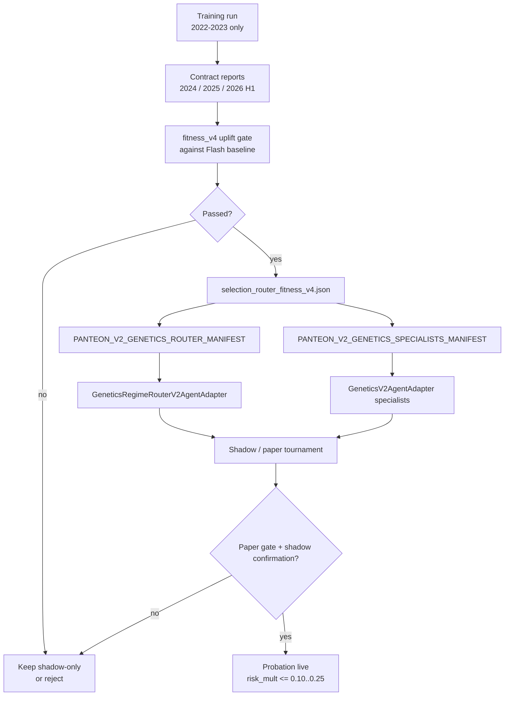

# Генетические агенты в Panteon

Документ описывает, как устроены генетические агенты, как они обучаются, как проходят валидацию и каким образом подключаются к Panteon v2 / Panteon Flash. Главный принцип текущей архитектуры: генетика не получает live-доступ только потому, что у нее высокий fitness. Она должна доказать uplift против baseline Flash на разнесенных периодах и пройти shadow/paper/probation-гейты.

## 1. Роль генетических агентов

Генетический агент - это нейросетевой policy-actor, веса которого хранятся как плоский genome-массив `.npy`. Он получает рыночные признаки по символам, выбирает действие, а затем через v2-адаптер становится обычным агентом в Panteon.

В production-контуре генетика рассматривается как экспериментальный источник сигналов, а не как замена Flash:

- `Panteon Flash` остается главным baseline и точкой сравнения.
- Генетические агенты сначала работают в shadow/paper.
- Реальная торговля возможна только через probation с ограниченным risk multiplier, допустимыми режимами, подтверждением shadow и лимитом реальных сделок.
- Router должен иметь fallback к baseline, если режим не распознан уверенно или кандидат не прошел гейты.

Общий поток:

```text
Retro data -> imitation seed -> genetic evolution -> contract evaluation
    -> fitness_v4/uplift gates -> specialists manifest/router
    -> optional registration in Panteon -> shadow/paper/probation
    -> only then limited live execution
```

## 2. Основные файлы

| Файл | Назначение |
| --- | --- |
| `Genetics_DL_Agents/crypto_genetics.py` | Основной trainer и runtime-класс `GeneticsAgent`; режимные классы `GeneticsBearishAgent`, `GeneticsNeutralAgent`, `GeneticsBullishAgent`. |
| `Genetics_DL_Agents/settings_genetic.txt` | Базовые параметры population/evolution/fitness/BC/архивации. |
| `Genetics_DL_Agents/Agents/genetics/` | Дефолтное место текущих production-кандидатов: `best_genome.npy`, `best_island_*.npy`, meta-файлы. |
| `tools/start_genetics_v4_heavy_training.ps1` | Запуск тяжелого обучения в отдельный `Results/neiro_genetics/.../agents`, без перезаписи production genome. |
| `tools/run_genetics_v4_post_training.ps1` | Пост-валидация: train 2022-2023, validation 2024, OOS 2025, sanity 2026 H1, затем selection. |
| `tools/evaluate_genetics_contract.py` | Contract-aware evaluation genome-ов на retrodate данных. |
| `tools/select_genetics_candidate.py` | Выбор single/router-кандидата, fitness_v4 gates, specialists manifest. |
| `src/panteon_v2/analysis/genetics_validation.py` | `fitness_v4_robust_score` и uplift gates против baseline. |
| `src/panteon_v2/app/agent_bootstrap.py` | Регистрация optional genetics-агентов и manifest/router в `AgentRegistry`. |
| `src/panteon_v2/shadow/adapters.py` | Адаптеры v1 -> v2: `GeneticsV2AgentAdapter`, `GeneticsRegimeRouterV2AgentAdapter`. |
| `src/panteon_v2/app/bootstrap.py` | Live/probation guardrails для genetics execution. |

## 3. Genome и нейросеть

`GeneticsAgent` использует MLP:

```text
28 inputs -> 128 -> 64 -> 32 -> 9 actions
activation: ELU
genome size: 14,345 float32 parameters
```

Genome - это последовательная упаковка весов и bias-ов всех слоев. При загрузке агент ожидает размер `GENOME_SIZE`; старые genome меньшего размера могут быть padded нулями в первом слое, слишком большие обрезаются. Это механизм совместимости, но для production такой genome надо переобучать, потому что новые признаки не были оптимизированы.

Основные артефакты:

- `best_genome.npy` - лучший общий genome.
- `best_genome_meta.json` - generation, fitness, `max_pos`, флаг `position_state_features_enabled`.
- `best_island_bearish.npy`, `best_island_neutral.npy`, `best_island_bullish.npy` - лучшие genome-и режимных островов.
- `best_island_{regime}_meta.json` - meta для режимного агента.
- `archive_rank*.npy` - архив top-кандидатов.
- `training_log.json`, `training_report.json`, `training_progress.png` - диагностика обучения.

## 4. Входные признаки

Runtime и trainer должны считать признаки одинаково. Текущая схема `N_INPUT=28`:

| Индекс | Признак |
| --- | --- |
| 0-3 | Momentum на разных горизонтах: 1h, 24h, 72h, 168h. |
| 4 | RSI, нормированный вокруг 50. |
| 5-6 | EMA ratios: быстрый и медленный тренд. |
| 7 | Volume ratio. |
| 8 | Bollinger band score. |
| 9-11 | One-hot режим: bearish, neutral, bullish. |
| 12 | Spot PnL state feature. |
| 13 | Futures PnL state feature. |
| 14 | Position size / exposure state. |
| 15-18 | Технический контекст: noise, global volatility, EMA breadth и связанные признаки. |
| 19-20 | Сезонность месяца: sin/cos. |
| 21 | Regime confidence. |
| 22 | ATR rank. |
| 23 | Momentum efficiency. |
| 24 | Volume trend. |
| 25 | Reserve. |
| 26 | Cross-sectional momentum rank. |
| 27 | Cross-sectional volume rank. |

Признаки 12-15 требуют особого контроля. В обучении они могут быть включены через `position_state_features_enabled`; в live дефолт задается `position_state_features_live_default` и может быть переопределен meta-файлом genome. Если training/live различаются, результаты становятся несопоставимыми.

## 5. Действия и contract

Внутри trainer-а сеть выбирает одно из 9 действий:

| Raw action | Смысл в trainer/runtime |
| --- | --- |
| 0 | hold |
| 1 | buy spot half |
| 2 | buy spot full |
| 3 | sell spot |
| 4 | futures long half |
| 5 | futures long full |
| 6 | futures short half |
| 7 | futures short full |
| 8 | close futures |

В live-методе `GeneticsAgent.act()` действия сворачиваются в legacy-коды `0..5`, которые затем `GeneticsV2AgentAdapter` мапит в v2 `Action`:

| Legacy code | v2 Action |
| --- | --- |
| 0 | `HOLD` |
| 1 | `SPOT_BUY_FULL` |
| 2 | `SPOT_SELL_ALL` |
| 3 | `FUT_LONG_FULL` |
| 4 | `FUT_SHORT_FULL` |
| 5 | `FUT_CLOSE_ALL` |

Важные contract-ограничения:

- `MAX_POS` ограничивает число одновременно открытых символов.
- Усреднение spot/long/short разрешено только в допустимом направлении.
- Futures long и futures short по одному символу не открываются одновременно.
- Invalid open подавляется и штрафуется в fitness/contract metrics.
- В live отключен конфликтный swap action: агент не должен отдавать код, который на биржевом пути трактуется как `close_all`.
- После исполнений адаптер вызывает `update_from_exchange()`, чтобы синхронизировать `spot_qty`, `spot_entry`, `fut_qty`, `fut_entry`.

## 6. Обучение

Обучение состоит из двух этапов: imitation seed и evolution.

### 6.1. Imitation / behavior cloning

В `settings_genetic.txt` включен `bc_enabled = on`. При `agent_seed_list = Panteon_Flash` trainer раскрывает alias в curated набор сильных компонентов Flash, например `MomentumScalper`, `LiveOIBreakout`, `VolBreakoutHunter`, `ResearchValidatorAgent`, `CrashPanicShortAgent`. Идея: сначала приблизить policy к уже полезным решениям, а не начинать evolution с полностью случайного поведения.

BC-seed попадает только от агентов, которые реально генерируют достаточно действий на train-периоде. Это защищает population от "мертвых" teachers, которые почти всегда держат hold.

### 6.2. Evolution

Базовые параметры тяжелого режима:

- `pop_size = 900`
- `n_generations = 100`
- `n_islands = 3`
- `train_max_pos = 4`
- `n_workers = 4` в базовом конфиге, но heavy launcher на Windows включает `cpu_batch_evaluator = on` и `n_workers = 1` для стабильности.

Поиск комбинирует:

- elite/tournament selection;
- crossover и mutation;
- island migration;
- DE/NES/CMA-like perturbations;
- Levy и diversity injections;
- staged phases для раннего exploration и последующего exploitation.

Текущий heavy launcher пишет результаты в отдельный run-dir:

```powershell
.\tools\start_genetics_v4_heavy_training.ps1 `
  -RunDir Results\neiro_genetics\heavy_evolution_v4_train_2022_2023 `
  -TrainStartDate 2022-01-01 `
  -TrainEndDate 2023-12-31 `
  -Population 900 `
  -Generations 100
```

Он специально задает:

- `GENETICS_AGENTS_DIR=<run_dir>\agents`, чтобы не перезаписать production `best_genome.npy`;
- `GENETICS_SETTINGS_FILE=<run_dir>\settings_genetic_train.txt`;
- `GENETICS_TRAIN_START_DATE/END`;
- `continue_training = off`, `load_best_genome = off`, `load_extra_genomes = off`.

Завершение процесса само по себе не означает успешное обучение. Минимальная проверка: в `agents` должны появиться `best_genome.npy`, meta/report/log artifacts и хотя бы один кандидат помимо baseline.

## 7. Fitness v4 и uplift gates

Главная метрика отбора - uplift против Flash baseline, а не raw return кандидата. Рекомендуемая временная схема:

```text
train:      2022-01-01 .. 2023-12-31
validation: 2024-01-01 .. 2024-12-31
OOS:        2025-01-01 .. 2025-12-31
sanity:     2026-01-01 .. 2026-06-30
```

`fitness_v4_robust_score` - это robust utility:

```text
regime_balanced_mean
  - CVaR/downside penalty
  - turnover penalty
  - saturation penalty
  - invalid-open penalty
  - cost/slippage penalty
  - single-period concentration penalty
```

Жесткие default gates:

- positive-period rate не ниже порога;
- максимальный вклад одного положительного периода не выше `30%` по умолчанию;
- turnover в пределах gate;
- saturation в пределах gate;
- invalid-open pressure в пределах gate;
- присутствуют требуемые режимы, включая crash/bearish/neutral/bullish.

Promotion/uplift gate сравнивает candidate с matched baseline:

- `mean_ret_delta >= 0`;
- `min_ret_delta >= 0`;
- `positive_period_pct_delta >= 0`;
- `max_turnover_rate`, `max_saturation_rate`, `max_invalid_open_pressure` в пределах gate;
- `max_positive_contribution_pct` не выше лимита концентрации;
- те же проверки повторяются на validation, OOS и final sanity.

Это намеренно отличается от "fitness ради fitness": высокий standalone score не проходит, если он хуже Flash baseline на худшем периоде или живет за счет одного удачного окна.

## 8. Mixture/router вместо одного genome

Сейчас есть два уровня специализации.

### 8.1. Режимные island-агенты

В `crypto_genetics.py` есть:

- `GeneticsBearishAgent` -> `best_island_bearish.npy`;
- `GeneticsNeutralAgent` -> `best_island_neutral.npy`;
- `GeneticsBullishAgent` -> `best_island_bullish.npy`.

Каждый наследуется от `GeneticsAgent`, но загружает свой режимный genome. Если режимный файл отсутствует, агент может fallback-нуться на `best_genome.npy`.

### 8.2. Manifest specialists

`tools/select_genetics_candidate.py` строит manifest для набора:

- `GeneticsBest`;
- `GeneticsCrash`;
- `GeneticsBearish`;
- `GeneticsNeutral`;
- `GeneticsBullish`.

Важно: `GeneticsCrash` в текущей runtime-реализации не является отдельным классом в `crypto_genetics.py`. Это manifest label, который грузится через обычный `GeneticsAgent(genome=...)`. Если crash-кандидат не доказал OOS-качество, manifest ставит туда risk-off fallback.

Manifest содержит:

- `specialist_genome_map`;
- `selected_regime_map`;
- `baseline_regime_map`;
- `promotion_failures`;
- flags `promotion_eligible`, `paper_trading_eligible`, `live_trading_eligible`.

Builder manifest-а намеренно выставляет `promotion_eligible = false`, `paper_trading_eligible = false`, `live_trading_eligible = false`, пока не пройдены дополнительные Flash/shadow/paper проверки.

### 8.3. Regime router

`GeneticsRegimeRouterV2AgentAdapter` получает baseline-agent и map режимов:

```text
if market.regime_confidence < min_regime_confidence:
    use baseline_agent
else:
    use regime_agents[market.regime] or baseline_agent
```

Дефолтный `min_regime_confidence` в builder-е - `0.70`. Это ключевой safety-механизм: router не обязан верить слабому режимному классификатору.

## 9. Как генетика включается в Panteon

Генетика не грузится при обычном старте по умолчанию. Причина практическая: импорт `crypto_genetics` тяжелый, поднимает numba/settings/datasets и может замедлять startup.

### 9.1. Optional V1 agents

В `src/panteon_v2/app/agent_bootstrap.py` список `OPTIONAL_V1_AGENTS` содержит:

```text
GeneticsGenomeEnsemble -> agents_v2:GenomeEnsembleAgent
GeneticsCore           -> crypto_genetics:GeneticsAgent
GeneticsBullish        -> crypto_genetics:GeneticsBullishAgent
GeneticsBearish        -> crypto_genetics:GeneticsBearishAgent
GeneticsNeutral        -> crypto_genetics:GeneticsNeutralAgent
```

Они регистрируются только если:

- `register_all_v1_agents(..., include_optional=True)`;
- или env `PANTEON_V2_LOAD_GENETICS=1`;
- или явный вызов `register_optional_agents(...)`.

Все `crypto_genetics:*` оборачиваются в `GeneticsV2AgentAdapter`, который переводит legacy action codes в v2 `Action`.

### 9.2. Manifest specialists

Для manifest-specialists используется env:

```powershell
$env:PANTEON_V2_GENETICS_SPECIALISTS_MANIFEST = "C:\Work\Crypto_exchange\Results\neiro_genetics\<run>\genetics_specialists_manifest.json"
```

После этого `register_optional_agents(...)` может зарегистрировать labels:

```text
GeneticsBest
GeneticsCrash
GeneticsBullish
GeneticsBearish
GeneticsNeutral
```

Ограничения loader-а:

- все genome paths должны быть внутри `Results/neiro_genetics`;
- размер genome должен совпадать с `GENOME_SIZE`;
- manifest-specialists регистрируются `shadow_only = true`;
- `live_trading_eligible` для них принудительно `false`.

То есть manifest specialists нужны для shadow/paper сравнения и анализа, а не для прямого live.

### 9.3. Regime router

Router подключается через:

```powershell
$env:PANTEON_V2_GENETICS_ROUTER_MANIFEST = "C:\Work\Crypto_exchange\Results\neiro_genetics\<run>\selection_router_fitness_v4.json"
$env:PANTEON_V2_LOAD_GENETICS_ROUTER = "1"
```

И label:

```text
GeneticsRegimeRouter
```

Live eligibility router-а жестче, чем простая загрузка:

- selection не должен быть baseline;
- validation mean должен быть выше baseline;
- validation min не хуже baseline;
- positive-period rate не хуже baseline;
- `live_trading_eligible = true` в selection;
- `paper_trading_eligible = true`;
- `paper_gate.paper_trading_eligible = true`;
- нет `paper_failures`;
- есть минимум два `paper_reports`;
- каждый paper report имеет `accepted = true`.

Если эти условия не выполнены, adapter остается `shadow_only`.

## 10. Как это попадает в Flash

После регистрации genetics-агенты становятся обычными actors/agents в `AgentRegistry`. Далее они могут:

- участвовать в shadow tournament;
- попадать в candidate pool Flash;
- иметь attribution по signal key;
- быть отфильтрованы degradation/deny/open-regime gates;
- получить paper/probation статус только через manifest и execution config.

Flash не обязан выбирать генетику. Он выбирает лучший actor per symbol/action на основе своих правил, статистики, gates и текущего режима. Если genetics-сигнал деградирует, он должен быть отключен так же, как любой другой actor.

## 11. Live/probation guardrails

В `LiveExecutionConfig` есть отдельный блок genetics probation:

| Поле | Назначение |
| --- | --- |
| `genetics_probation_execution_enabled` | Разрешает реальное исполнение probation-сигналов. По умолчанию `false`. |
| `genetics_probation_labels` | Какие labels могут быть probation-кандидатами. |
| `genetics_probation_allowed_regimes` | Режимы, где разрешены real opens; по умолчанию bearish/crash. |
| `genetics_probation_allowed_signal_keys` | Явный allowlist signal keys; пустой список означает отсутствие расширенного allowlist. |
| `genetics_probation_risk_mult` | Множитель риска, по умолчанию `0.25`; для новых агентов целевой диапазон `0.10..0.25`. |
| `genetics_probation_min_regime_confidence` | Минимальная уверенность режима. |
| `genetics_probation_max_real_trades` | Верхний лимит реальных сделок в probation. |
| `genetics_probation_require_shadow_confirmation` | Требовать shadow confirmation. По умолчанию `true`. |

Практическое правило: без multi-split paper gate и shadow confirmation genetics должна оставаться shadow-only.

## 12. Рекомендуемый workflow продвижения

1. Запустить heavy training только на train-window 2022-2023.
2. Убедиться, что появились реальные training artifacts: `best_genome.npy`, meta/report/log/archive.
3. Выполнить post-training validation:

```powershell
.\tools\run_genetics_v4_post_training.ps1 `
  -RunDir Results\neiro_genetics\<run> `
  -AgentsDir Results\neiro_genetics\<run>\agents `
  -BaselineGenome Results\neiro_genetics\<run>\baseline_control_best_genome.npy
```

4. Проверить `selection_single_fitness_v4.json` и `selection_router_fitness_v4.json`.
5. Если router лучше single и проходит gates, собрать specialists manifest.
6. Подключить manifest только в shadow/paper.
7. Сравнить Flash baseline vs Flash+genetics на:

```text
2022-2023 train
2024 validation
2025 OOS
2026 H1 sanity
rolling folds with embargo
```

8. Включать probation только если:

- mean uplift не хуже 0;
- min uplift не хуже 0;
- positive-period rate не хуже baseline;
- turnover/saturation/invalid-open в gate;
- нет single-period concentration;
- paper gate принят минимум двумя независимыми отчетами;
- включены low-risk guardrails.

## 13. Что считать неуспешным кандидатом

Кандидат не должен продвигаться, если выполняется хотя бы одно:

- нет `best_genome.npy` или training report после evolution;
- selection выбрал baseline;
- validation лучше за счет одного периода;
- 2025 OOS или 2026 H1 sanity имеют отрицательный mean/min uplift;
- positive-period rate хуже Flash baseline;
- turnover или saturation выше gate;
- высокий invalid-open pressure;
- crash/bearish/neutral/bullish router не имеет fallback к baseline;
- paper reports отсутствуют или меньше двух;
- manifest содержит `promotion_failures`;
- требуется сразу live без shadow/probation.

## 14. Contra overlay как risk sizing

Contra overlay не должен быть binary allowlist для genetics. Его роль - снижать drawdown и масштабировать риск:

```text
target: DD improvement >= 1 pp
allowed PnL degradation: not worse than -0.25 pp
otherwise: do not enable overlay in live
```

То есть если overlay уменьшает просадку, но слишком сильно режет PnL, он остается исследовательским фильтром. Для live он должен выражаться через `risk_mult`, allowed regimes и signal-key gates.

## 15. Минимальная диагностика перед ретротестом

Перед 5-летним retrotest сборки с генетикой нужно проверить:

```powershell
Test-Path Results\neiro_genetics\<run>\agents\best_genome.npy
Test-Path Results\neiro_genetics\<run>\selection_router_fitness_v4.json
Test-Path Results\neiro_genetics\<run>\contract_validation_2024.json
Test-Path Results\neiro_genetics\<run>\contract_oos_2025.json
Test-Path Results\neiro_genetics\<run>\contract_final_sanity_2026_h1.json
```

Если этих файлов нет, можно тестировать только текущий Flash/baseline или старый production genome, но не "новый v4 genetics candidate".

## 16. Короткая схема подключения



