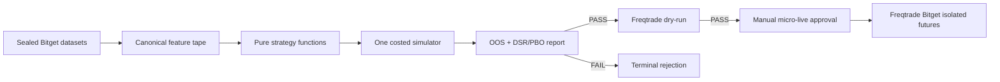

# Перезапуск проекта торгового бота: решение по архитектуре и выходу в live

Дата аудита: 2026-08-03  
Область: Bitget USDT perpetual futures  
Статус live: запрещен; `orders_enabled=false`, `promotion_authority=false`

## 1. Решение в одном абзаце

Продолжать развивать текущий Pantheon как live-систему не следует. Проект уже
доказал инженерную работоспособность защитных механизмов, но не доказал
наличие торгового преимущества. Главный следующий шаг — не еще один агент,
gate или canary, а отделение исследования стратегии от исполнения. Текущий
Pantheon нужно заморозить как архив исследований и источник данных. Новый
live-path следует построить на Freqtrade с одной стратегией, одним cost model,
одним backtest/dry/live contract и без Flash, Genetics, ансамбля, tournament,
динамического selector и цепочки promotion-артефактов. До live проект получает
один ограниченный исследовательский бюджет: единообразно перепроверить все
существующие стратегии и несколько простых baseline на длинном датасете. Если
ни одна стратегия не проходит заранее зафиксированные OOS и multiple-testing
критерии, разработку прибыльного directional-бота следует остановить.

## 2. Что фактически создано

### 2.1. Код и сложность

Текущий объем только `src/panteon_v2` и `tools`:

| Показатель | Значение |
|---|---:|
| Python-файлы | 392 |
| Строки Python | около 183 923 |
| CLI-инструменты | 108 |
| Тестовые модули | 143 |
| Уникальные `PANTEON_*` env-переменные | 40 |
| Зарегистрированные базовые v1-агенты | 21 |
| Коммиты с 2026-05-12 | 84 |

Наиболее крупные production-модули уже сопоставимы с отдельными приложениями:
`retrodate_market_runner.py` — 8 389 строк, `main_loop.py` — 7 250,
`flash_allocator.py` — 6 641, `startup.py` — 4 312,
`strategy_lab.py` — 3 124, `strategist.py` — 2 767. Сам старый класс
`Panteon` находится внутри файла `panteon_agents.py` размером более 7 900 строк.

Это не означает, что код автоматически плох. Это означает, что стоимость
проверки причин любого сигнала или отсутствия сделки стала несоразмерна
текущей доказательной базе торговых моделей.

### 2.2. История разработки

Из 84 коммитов с мая 28 упоминают live, 11 — gates, 10 — fixes, 7 — hardening,
7 — Flash, 5 — Genetics и 9 — retro. Последовательность была примерно такой:

1. Создан ансамбль агентов и shadow tournament.
2. Добавлены allocator, Flash, memory, quarantine и regime routing.
3. Исправлялись различия между retro, shadow, paper и live.
4. Добавлялись fee, slippage, LCB, matrix, canary и promotion gates.
5. Ensemble был заменен singleton/policy-only route.
6. CarryFlow был выбран как простой кандидат и terminal-rejected.
7. Были построены отдельные historical strategy lab и Bitget data layer.
8. Девять семейств стратегий получили terminal rejection.
9. Новый h120-кандидат выглядел положительно на development, но провалил первую
   prospective validation-сессию.

Gates не являются ошибкой: они предотвратили запуск отрицательных стратегий на
реальных деньгах. Ошибка — ожидание, что исправление очередного gate создаст
edge. Gate только измеряет стратегию; он не делает ее прибыльной.

### 2.3. Состояние Git

Опубликованный HEAD — `91d1052` от 2026-07-27. Новый data layer v2/v3,
prospective campaign и часть strategy lab находятся в dirty/untracked
worktree. Текущий эксперимент поэтому нельзя считать полностью
воспроизводимой опубликованной версией, несмотря на проходящие тесты. Перед
любым новым направлением нужен freeze commit/tag, а не продолжение поверх
неопубликованного слоя изменений.

## 3. Что показывают данные

### 3.1. Доступные датасеты

| Датасет | Покрытие | Размер выборки | Назначение |
|---|---|---:|---|
| `bitget_futures_history_v3_2022_20260714` | 2022-01-01 — 2026-07-14, full8, 1h | 317 952 баров | Основной multi-regime research/OOS |
| `bitget_1m_discovery_v1_20260615_20260728` | 44 дня, full8, 1m | 506 880 баров | Intraday screening и signal cadence |
| Raw microstructure session 20260729 | 24h | 10 493 861 events | Book/trade/OI execution calibration |
| Raw microstructure session 20260801 | 12h | 4 368 158 events | Independent development |
| Raw microstructure session 20260802 | 12h | 4 367 008 events | Prospective validation |

Исторический hourly-датасет имеет 100% внутреннюю непрерывность для full8.
44-дневный 1m-датасет также имеет 100% внутреннюю непрерывность. Три длинные
microstructure-сессии содержат суммарно около 19,23 млн событий и 48 часов
реального Bitget tape.

Вывод: проблема больше не в полном отсутствии данных. Для hourly/4h/daily
исследований данных достаточно для строгого первичного отбора. Для
microstructure alpha 48 часов недостаточно для надежной статистики, но
достаточно для калибровки spread, slippage, book depth и проверки parity.

### 3.2. Качество data layer

Исправление event-driven semantics для `books5` подняло eligible-bar coverage
с 92,60% до 99,72% на одной из 12-часовых сессий. Последняя prospective
сессия имеет:

| Проверка | Результат |
|---|---:|
| Raw hash-chain | PASS |
| Sealed segments | 49 |
| Frame coverage | 99,95% |
| Eligible bars | 98,61% |
| WebSocket disconnect | 3, восстановлены |
| REST errors | 1 временный HTTP 429 |

123 `exchange_timestamp_regression` относятся к отдельным trade-сообщениям
LINK/BNB/DOGE. Materialization использует receive-time и сохраняет события;
эти quality events нужно учитывать, но они не объясняют отрицательный результат
стратегии. У последнего кандидата gross expectancy была только `+2,13 bps` при
средних затратах `12,52 bps`.

### 3.3. Результаты стратегий

Реестр фиксирует terminal rejection следующих семейств:

| Семейство | Основной результат |
|---|---|
| CarryFlow flow features | prospective expectancy отрицательная; root instability |
| Range-transition breakout | 8 trades, `+11,74 bps`, но LCB `-15,82 bps` и root collapse |
| Regime pullback | mean `-4,36 bps`, LCB `-18,55 bps` |
| Compression transition | mean `-3,92 bps`, LCB `-14,57 bps` |
| Funding carry | projected carry ниже cost floor; zero signals |
| Cross-sectional trend | point estimate `+48,28 bps`, LCB `-54,53 bps`, хуже baseline |
| Market-neutral relative momentum | `+13,04 bps`, LCB `-74,06 bps` |
| Weekly top2/bottom2 | `+50,83 bps`, LCB `-22,99 bps`, хуже baseline |
| Cointegration spread | gross `+14,57 bps`, stress mean `-3,43 bps` |

Последний `oi_change_return_momentum_h120_v1` был выбран после исследования
4 824 комбинаций. Development дал 15 сделок, mean net `+20,65 bps` и stress
LCB `+2,47 bps`. Первая независимая prospective session дала 4 сделки,
gross `+2,13 bps`, net `-10,39 bps`, stress `-14,39 bps`; campaign корректно
завершился `rejected_early`.

Это характерный пример selection bias: положительный максимум среди тысяч
вариантов не является независимым доказательством. Deflated Sharpe Ratio был
создан именно для учета числа испытаний, ненормальности доходностей и
backtest-overfitting:
[Bailey and López de Prado](https://papers.ssrn.com/sol3/papers.cfm?abstract_id=2460551).

## 4. Корневые причины цикла

### 4.1. Искался сложный selector до доказательства базовых стратегий

Pantheon, Flash и Genetics отвечают на вопрос «кого выбрать». Но для этого в
пуле должен существовать хотя бы один независимо подтвержденный положительный
actor. Реестр показывает, что такого actor нет. Ансамбль отрицательных или
нестабильных моделей не создает положительное математическое ожидание.

### 4.2. Слишком дорогой торговый режим

Многие эксперименты использовали short-horizon taker entry/exit. Реальный
round-trip в microstructure labels составляет примерно 12–16 bps. Последняя
validation показала типичный результат: цена прошла в среднем `+2,13 bps`, но
издержки составили `12,52 bps`. Даже правильный знак движения недостаточен.

### 4.3. Research и live развивались одновременно

Изменения strategy logic, data semantics, selection, readiness, execution и
monitoring часто попадали в один длинный путь. Поэтому отрицательный результат
мог инициировать исправление инфраструктуры, а после исправления — новый
подбор модели. Это создавало ощущение прогресса, но не увеличивало независимую
доказательную базу edge.

### 4.4. Несколько несовместимых backtest-путей

В проекте есть legacy retro, market runner, policy replay, evidence tape,
campaign replay, canary, shadow tournament и отдельные strategy lab. Разные
пути используют разные cadence, warm-up, exits, costs и правила выбора. Даже
при тестах это увеличивает риск, что исследуется не та логика, которая потом
работает live.

### 4.5. Слишком много post-hoc вариантов

Порог, regime, direction, symbol slice, exit и holding period многократно
менялись после просмотра результата. Реестр правильно запрещает повторное
использование раскрытого OOS, но сам процесс уже накопил большой hidden trial
count. Обычный LCB не компенсирует тысячи проведенных сравнений.

### 4.6. Проверялось слишком много low-incidence идей на коротком live tape

12-часовая сессия полезна для execution parity, но не для доказательства
редкого alpha. Если стратегия дает 3–5 сделок за 12 часов, даже положительный
результат практически ничего не доказывает; отрицательный результат может быть
полезен только как early-stop.

## 5. Разбор предложенных вариантов

### Вариант 1. Взять готового Bitget-бота из сети

#### Что реально можно получить

Готовый open-source бот дает надежный connector, lifecycle ордера, persistence,
dry-run, backtest, stop-loss и UI. Он не дает гарантированное alpha.

**Freqtrade** поддерживает Bitget spot и isolated futures, market/limit orders,
on-exchange stop-loss, backtesting, dry-run и один strategy interface:
[официальная документация](https://docs.freqtrade.io/en/latest/),
[Bitget notes](https://docs.freqtrade.io/en/latest/exchanges/). Это лучший
вариант для directional/candle стратегий и рекомендуемая основа нового пути.

**Hummingbot** имеет актуальные `bitget` и `bitget_perpetual` WebSocket
connectors, market/limit orders и one-way/hedge modes:
[Bitget connector](https://hummingbot.org/exchanges/bitget/). Он лучше подходит
для market making, inventory control и cross-exchange execution, но не заменяет
исследование adverse selection и maker edge.

**Passivbot** прямо поддерживает Bitget perpetual и использует общий Rust
orchestrator для backtest/live:
[репозиторий](https://github.com/enarjord/passivbot). Однако его базовая идея —
contrarian grid с усреднением убыточной позиции, близким к martingale. Это
создает тяжелый tail risk. В репозитории также нет обещания готовой прибыльной
конфигурации. Для данного проекта Passivbot можно исследовать только отдельно,
но нельзя брать как безопасную замену стратегии.

#### Оценка

| Критерий | Оценка |
|---|---|
| Скорость получения надежного execution | Высокая |
| Снижение собственного кода | Очень высокое |
| Получение прибыльного edge | Не гарантируется |
| Риск интеграции | Низкий для Freqtrade, средний для Hummingbot |
| Рекомендация | Использовать Freqtrade как infrastructure, не чужой black-box signal |

### Вариант 2. Начать с нуля и постепенно включать наработки

Полный rewrite с собственным Bitget connector повторит уже решенную работу и
снова смешает infrastructure с alpha. Но clean-room **thin strategy core** на
готовом framework имеет смысл.

Разрешено перенести только:

- sealed datasets и validators;
- централизованный cost model;
- Bitget symbol/min-notional/rule checks;
- server-side stop и daily loss guard;
- immutable experiment registry;
- проверенные тесты отсутствия lookahead.

Не переносить:

- Flash allocator;
- Genetics и genome ensemble;
- actor tournament;
- memory/quarantine scoring;
- regime router как отдельный selector;
- dynamic fallback;
- старый Panteon class;
- несколько replay/canary реализаций.

Оценка: хороший вариант только в форме Freqtrade + тонкая стратегия. Полностью
самописный rewrite займет больше времени и не повысит вероятность edge.

### Вариант 3. Продолжать текущую версию

Преимущество — большая тестовая база и уже реализованные safety guards.
Недостатки — огромная cognitive surface, несколько путей исполнения,
неопубликованный слой изменений и отсутствие положительного actor.

Продолжение оправдано только как read-only архив и источник сравнительных
данных. Как основной live-path вариант не рекомендуется.

Вероятный результат продолжения без архитектурного reset: очередной кандидат,
новый artifact/gate, короткий prospective test, еще одна terminal rejection.

### Вариант 4. Максимально упростить текущую версию и быстро перепроверить модели

Это наиболее полезная часть предлагаемого решения, но выполнять ее следует в
новом изолированном контуре, а не вырезанием модулей из работающего Pantheon.

Нужен один canonical dataset contract:

```text
timestamp, symbol, OHLCV,
funding/OI/basis where available,
book/spread/slippage calibration where available,
regime features,
future executable labels,
source/session/continuity identifiers
```

Нужен один strategy protocol:

```python
signal(frame) -> {-1, 0, +1}
```

Нужен один simulator contract:

```text
signal -> next tradable price -> centralized fees/slippage -> position state
       -> exit -> trade ledger -> costed metrics
```

Все модели должны получать один и тот же frame и исполняться одним и тем же
simulator. Нельзя позволять агенту иметь собственные fee, slippage, sizing,
warm-up или скрытый exit.

Следует сохранить два связанных артефакта:

1. **Feature tape** — фактические наблюдения рынка, пригодные для любой модели.
2. **Decision tape** — raw signals всех старых агентов на тех же timestamps,
   чтобы проверять parity и быстро сравнивать модели.

Копировать только старые сигналы недостаточно: это не позволит тестировать
новые модели. Правильная основа — immutable feature tape, а signal columns
являются производным кэшем.

#### Какие модели перепроверить

**Tier A: OHLCV-compatible.** MomentumScalper, LiveTrendFollow,
RichardDennis, LiveMeanRev, LiveVolCompress, LiveRegimePullback,
VolBreakoutHunter, CandlePattern и простые baseline. Тестировать на 4,5 годах
1h и 44 днях 1m.

**Tier B: context-dependent.** LiveOIBreakout, CarryFlowAgentV2,
FundingArb, NeutralLiquiditySweep, AnchorFlowMomentum. Тестировать на 48h
microstructure tape только как execution/context diagnostic; этого объема
недостаточно для promotion.

**Tier C: selectors.** Pantheon, Flash, Genetics и ансамбли не тестировать до
появления минимум двух независимо положительных Tier A/B стратегий. Сейчас их
использование статистически и архитектурно преждевременно.

### Вариант 5. Другие подходы

#### 5.1. Сменить торговую задачу

Текущий short-horizon taker directional режим — неблагоприятный выбор для
небольшого независимого бота. Рассматривать по отдельности:

| Направление | Framework | Главный риск |
|---|---|---|
| Low-turnover 4h/1d trend | Freqtrade | Долгие drawdown и regime dependence |
| Spot/perp basis или funding arbitrage | Hummingbot/custom | Нужны полные funding/basis данные и капитал на обе ноги |
| Maker market making | Hummingbot | Adverse selection, inventory и queue position |
| Cross-exchange arbitrage | Hummingbot | Latency, transfer/capital fragmentation |
| Portfolio rebalancing | Freqtrade/custom | Это автоматизация allocation, не гарантированный alpha |

Нельзя смешивать эти направления в один ансамбль. Для каждого нужен отдельный
economic hypothesis, dataset и execution contract.

#### 5.2. Разделить два вида live

- **Engineering micro-live** проверяет connector, stop, precision, reconciliation
  и фактический slippage на минимальном допустимом notional. Он не доказывает
  прибыльность.
- **Profit-seeking live** разрешается только после статистического OOS и dry-run.

Смешение этих целей раньше создавало ситуацию, когда технический canary
воспринимался как шаг к доказательству edge.

#### 5.3. Ввести research budget

До открытия OOS заранее фиксируются:

- максимум 10 экономически различимых стратегий;
- максимум 3 варианта на семейство;
- один cost model;
- один primary metric;
- число всех испытаний для Deflated Sharpe/PBO;
- stop decision после исчерпания бюджета.

Новый threshold или symbol slice считается новым trial, а не исправлением
старой стратегии.

## 6. Почему у других боты работают

«Работающий бот» может означать разные вещи:

1. Он технически выставляет и сопровождает ордера.
2. Он автоматизирует уже существующую discretionary стратегию.
3. Он делает market making и получает spread/rebate, принимая inventory risk.
4. Он исполняет арбитраж с отдельным преимуществом в данных, капитале или
   latency.
5. Он показывает красивый backtest, но теряет после costs.
6. Он действительно прибыльный, но его edge обычно не публикуется вместе с
   готовой конфигурацией.

Создать технически работающий Bitget-бот возможно, и текущий проект уже близок
к этому. Создать гарантированно прибыльный бот невозможно как инженерную
задачу с известным результатом. Это исследовательская задача с высокой
вероятностью отрицательного исхода.

Наши неудачи не доказывают невозможность algorithmic trading. Они доказывают,
что проверенные short-horizon taker, CarryFlow, regime, breakout, funding,
relative momentum и cointegration варианты не имеют достаточно устойчивого
edge в доступных данных. Это полезный результат, если перестать повторять те же
семейства под новыми именами.

## 7. Рекомендуемый целевой вариант

Рекомендуется гибрид вариантов 1, 2 и 4:

1. Freqtrade используется как Bitget execution/backtest/dry-run framework.
2. Создается новый маленький research/live workspace, не импортирующий
   `panteon_v2` runtime.
3. Из текущего проекта импортируются только immutable данные, cost assumptions
   и несколько чистых signal functions.
4. Все старые модели перепроверяются одним batch runner.
5. Pantheon остается frozen research archive.



### Минимальная live-архитектура

Live-route должен содержать только:

```text
Bitget/Freqtrade feed
  -> one frozen strategy
  -> one position/risk policy
  -> Freqtrade order manager
  -> Bitget isolated futures
```

Развертывание имеет только следующие независимые параметры:

| Параметр | Назначение |
|---|---|
| `strategy_id` | SHA зафиксированной стратегии |
| `symbols` | Зафиксированный universe |
| `stake_notional` | Риск на вход |
| `max_open_positions` | Общий лимит |
| `leverage` | Только isolated, начально 1x |
| `max_daily_loss` | Kill switch |
| `mode` | dry-run или live |

Thresholds, regimes, exits и horizon являются частью strategy artifact и не
редактируются в live config.

## 8. Практический план

### P0. Freeze и воспроизводимость — 1–2 дня

1. Остановить создание новых Pantheon actors/campaigns.
2. Зафиксировать dirty worktree отдельным commit и tag как research snapshot.
3. Добавить последний h120 prospective rejection в experiment registry.
4. Создать SHA-инвентарь трех canonical datasets.
5. Запретить старому Pantheon любой real route на уровне launcher.

Результат: воспроизводимый архив; ни один старый artifact не может случайно
стать live policy.

### P1. Freqtrade execution spike — 2–3 дня

1. Развернуть Freqtrade в отдельном workspace/container.
2. Подключить Bitget isolated futures без ключа вывода средств.
3. Проверить market metadata, precision, min notional и server-side stop.
4. Провести dry-run на `NoTradeStrategy` и deterministic pulse strategy.
5. Сопоставить Freqtrade ledger с Bitget public tape.

Это только engineering acceptance. Прибыль не оценивается.

### P2. Canonical fast research — 3–5 дней

1. Нормализовать 4,5-летний 1h, 44-дневный 1m и 48h microstructure datasets.
2. Сформировать Parquet feature tapes и единый dataset manifest.
3. Реализовать один cost model с base/stress сценариями.
4. Реализовать один trade ledger schema.
5. Добавить trial registry и Deflated Sharpe/PBO accounting.

Цель производительности: полный Tier A batch менее 10 минут на локальном ПК;
одна стратегия — менее 30 секунд.

### P3. Перепроверка стратегий — 3–5 дней

1. Зафиксировать список максимум из 10 стратегий до просмотра нового OOS.
2. Перенести Tier A agents как pure signal functions.
3. Добавить простые baseline: flat, buy-and-hold benchmark, time-series trend,
   Donchian breakout и simple mean reversion.
4. Использовать anchored walk-forward и purging на holding horizon.
5. Применить единый fee/slippage stress и multiple-testing correction.

Стратегия проходит screening, только если:

- положительны validation и OOS after costs;
- positive stress expectancy;
- Deflated Sharpe probability проходит заранее заданный уровень;
- достаточное число независимых trades;
- нет symbol/direction/year concentration;
- max drawdown находится в бюджете;
- результат лучше простого baseline.

### P4. Решение продолжать или остановиться — один день

Если не прошла ни одна стратегия:

- остановить разработку прибыльного directional-бота;
- оставить data/execution stack для будущей внешней стратегии;
- не запускать новые Genetics/ensemble/threshold campaigns минимум до появления
  нового экономического источника edge или нового независимого датасета.

Если прошла ровно одна стратегия:

- заморозить ее SHA;
- не добавлять ensemble;
- перейти к dry-run.

### P5. Dry-run — минимум 2 календарные недели

Требования:

- минимум 30 closed trades либо заранее рассчитанный minimum track record;
- parity signal timestamps с backtest;
- no stale feed/reconciliation errors;
- costed expectancy не хуже допустимого confidence interval;
- отсутствие ручной подстройки параметров.

### P6. Manual micro-live

Только после ручного подтверждения:

- isolated futures;
- 1x leverage;
- один position slot;
- минимальный допустимый Bitget notional;
- server-side stop;
- жесткий daily loss;
- API key без withdrawal permission;
- заранее заданная дата автоматического expiry.

Micro-live сначала подтверждает исполнение. Увеличение капитала допускается
только после достаточного числа реальных сделок и повторной оценки expectancy.

## 9. Альтернативные планы

### План A — рекомендуемый reset

Freqtrade + canonical dataset + один strategy protocol. 1–2 недели инженерной
работы, затем 2+ недели dry-run. Лучшее соотношение скорости и риска.

### План B — собственный SimpleBot

Новый модуль примерно 3–5 тыс. строк: feed, strategy, portfolio, risk,
execution, persistence. Использовать только если Freqtrade не обеспечивает
обязательную semantics. Оценка 3–6 недель и больший execution risk.

### План C — Hummingbot market-making track

Отдельный проект, не продолжение Pantheon. Сначала 2–4 недели собирать L2/queue
evidence и моделировать adverse selection. Имеет смысл только при maker fee и
spread, покрывающих inventory losses. Не запускать параллельно с directional
reset: это другая гипотеза и другой бюджет.

### План D — остановка проекта

Рационален уже сейчас, если цель — гарантированная прибыль в короткий срок.
Если допустим еще один строго ограниченный цикл, выполнить только План A до P4.
Отсутствие survivor после P3 является окончательным stop condition, а не
поводом создать новый selector.

## 10. Итоговая рекомендация

Не прекращать проект немедленно, но прекратить текущую парадигму Pantheon.
Выполнить один bounded reset по Плану A. Не брать «готовую прибыльную
стратегию» из сети; взять зрелый execution framework. Не переписывать Bitget
connector. Не развивать ансамбль без положительных компонентов. Не проводить
новые 12-часовые prospective sessions до быстрого historical survivor.

Через P4 должен быть бинарный результат:

- есть стратегия, прошедшая единый длинный costed OOS — переход к dry-run;
- survivor нет — остановка alpha-разработки и сохранение проекта только как
  data/execution platform.

Это не обещает прибыль. Это прекращает бесконечный цикл и делает следующий
отрицательный результат конечным, а положительный — проверяемым.
