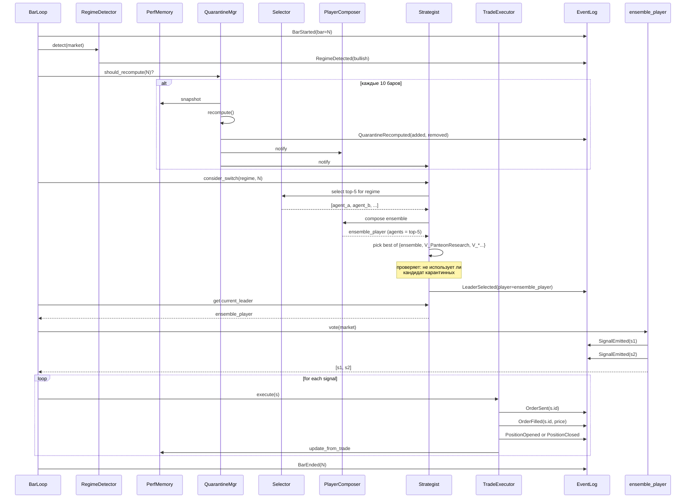

# Panteon v2 — архитектурный план

**Документ:** проект новой архитектуры боевой торговой системы Panteon.
**Цель:** устранить корневые причины багов, найденных в v1, и обеспечить
гарантии корректности на уровне дизайна, а не патчей.

**Контекст:** v1 был итеративно поправлен в 9+ итераций (динамический
карантин, per-regime скоринг, propagation на shadow-варианты, REAL-attribution,
per-symbol blocklist для failed orders), но остаются **архитектурные**
проблемы: дублирующиеся слои принятия решений, рассинхронизация состояния,
расхождение метрик с реальностью.

---

## 1. Реестр проблем v1

Это полная систематизация багов и архитектурных недостатков, обнаруженных
за все итерации работы над v1. Каждая проблема имеет приоритет и
указание, как новая архитектура её устраняет.

### 1.1 Проблемы выбора лидера и агентов

| # | Проблема | Приоритет | Корень |
|---|----------|-----------|--------|
| P1 | Статический `LIVE_AGENT_BLOCKLIST` (frozenset на классе) — нельзя обновить без рестарта | КРИТ | Hardcoded knowledge |
| P2 | Карантин не распространялся на наследников Panteon (`PanteonResearch`, `PanteonMeanRevResearch` и др.) — у них свои `_active_weights` | КРИТ | Дублирование состояния |
| P3 | Bootstrap shadow-вариантов содержал карантинных агентов (PanteonTrendResearch: 80% веса на 4 карантинных) | КРИТ | Bootstrap не знает про QM |
| P4 | `_score_shadow_candidate` давал бонус карантинным через `SCORE_BONUS_LABELS` | ВЫС | Bonus list не сверяется с QM |
| P5 | Агенты учитывали только агрегатный `pnl_pct`, без per-regime — `LiveRegimePullback` +0.71% в bullish/neutral/crash, но агрегат ~0% → не выбирался | КРИТ | Скоринг по неверной метрике |
| P6 | `closed_trades >= 5` hard cap блокировал ярких новичков (V_SoloLiveTrendFollow +0.60%, 2 closed) | ВЫС | Жёсткий порог |
| P7 | `PLAYER_HARD_NEGATIVE_SCORE = -1.25` — лидер с pnl=-0.30% не был urgent, держался 1.5 ч | СРЕД | Слишком терпимый порог |
| P8 | `PLAYER_SWITCH_COOLDOWN_BARS = 90` (~1.5ч) удерживал плохого делегата | СРЕД | Анти-flapping → удержание лозы |
| P9 | **Дублирование выбора лидера**: `_active_weights` (внутренний ансамбль) И `_selected_shadow_player` (делегация целиком игроку) — два независимых механизма, конфликтуют | КРИТ | Нет single source |
| P10 | `_rotate_risk_adjusted_top_positive` при `len(ranked) < min_agents` цеплялся к старым весам с убыточными | СРЕД | Default к stale state |
| P11 | Множество скоринговых функций (`_live_score`, `_combined_score`, `_risk_adjusted_positive_score`, `_score_shadow_candidate` × 2 версии) — каждая считает по-своему | КРИТ | Размножение логики |

### 1.2 Проблемы исполнения

| # | Проблема | Приоритет | Корень |
|---|----------|-----------|--------|
| P12 | Pending orders на BITGET для малоликвидных пар (NAORIS, AIGENSYN, BSB, LAB) — 10 failed_orders | ВЫС | Нет адаптивного skip-list |
| P13 | `position_book.pending_order` flag — единственный flag, нет per-symbol failure history | ВЫС | Слабое наблюдение |
| P14 | `inject_live_state_into_player` сбрасывает позиции, но не sub-agent state в полной мере | СРЕД | Partial reset |
| P15 | `[reconcile] X pending order not confirmed` повторяется бесконечно для одного символа | СРЕД | Нет circuit breaker |

### 1.3 Проблемы памяти и метрик

| # | Проблема | Приоритет | Корень |
|---|----------|-----------|--------|
| P16 | `stats.signals` и `stats.trades` не связаны — нет `signal_id` в trade, невозможно достоверно атрибутировать | КРИТ | Нет sequence linkage |
| P17 | `stats.sub_agent_pvs` считался фейково: `total_pnl * (sig_count / total_sigs)` | КРИТ | Ad-hoc формула |
| P18 | Захардкоженный список 5 sub-agent имён в формуле — реальных 25+ | ВЫС | Magic numbers/lists |
| P19 | shadow PnL ≠ real PnL Пантеона — на дашборде положительные shadow > отрицательных, но live в минусе | КРИТ | Нет привязки shadow ↔ real |
| P20 | `_regime_memory` на инстансе Panteon — варианты имеют свою копию, не синхронизируются | ВЫС | Дублирование |
| P21 | `_shadow_player_regime_memory` отдельно от `_regime_memory` — два регистра | СРЕД | Лишняя сущность |

### 1.4 Проблемы определения режима рынка

| # | Проблема | Приоритет | Корень |
|---|----------|-----------|--------|
| P22 | Несколько детекторов: `_detect_regime`, `_detect_regime_fast`, `_detect_regime_live`, `_canonical_market_regime`, `_canonical_dashboard_regime` — каждый канонизирует по-своему | ВЫС | Множественные источники |
| P23 | Глобальный режим vs per-symbol режим — несинхронны, иногда per-symbol используется при канонизации, иногда нет | СРЕД | Несогласованность |
| P24 | `REGIME_HYSTERESIS_BARS = 12` мешает быстрой реакции на crash | СРЕД | Один параметр для всех переходов |
| P25 | `regime_history` в leaderboard не используется в скоринге — только для отчётности | НИЗК | Mertвый actionable |

### 1.5 Проблемы дашбордов и отчётности

| # | Проблема | Приоритет | Корень |
|---|----------|-----------|--------|
| P26 | `api_trading.png` показывал shadow PV, противоречащий real PnL | КРИТ | Wrong data source |
| P27 | `shadow_agents_dashboard.png` и `api_trading.png` использовали разные источники → визуальный конфликт | ВЫС | Разрозненные сборщики |
| P28 | Карантинные агенты в `api_trading.png` не были серыми — пользователь не видел исключения | СРЕД | Status_map не пробрасывался |
| P29 | `status_legend` в `leaderboard_*.json` не обновлялся при изменении логики | НИЗК | Захардкожен |

### 1.6 Архитектурные проблемы

| # | Проблема | Приоритет | Корень |
|---|----------|-----------|--------|
| A1 | **Inheritance overload**: `Panteon → PanteonResearch → _PanteonShadowVariant → 6 подклассов`, у каждого свой state | КРИТ | Нарушение SRP |
| A2 | **Mutable shared state**: `LIVE_AGENT_BLOCKLIST` копируется через инстанс-атрибуты вручную | КРИТ | Нет observable state |
| A3 | **Hidden coupling**: `EnhancedSignalCapture._owner = monitor` — ad-hoc для доступа к health | СРЕД | Нет DI |
| A4 | **Two-loop architecture**: Panteon делает acts → отдельный monitor reconcileит позиции → отдельный thread рендерит дашборды → отдельный recompute карантина | КРИТ | Race conditions, eventual consistency |
| A5 | **String-based action codes**: 0-8, переменные `OPEN_LONG = {1, 2, 4, 5}` повторяются в нескольких местах | СРЕД | Magic numbers |
| A6 | **No traceability**: невозможно ответить «почему этот агент был выбран на этом баре?» | ВЫС | Нет decision log |
| A7 | **Bash mount/Edit tool inconsistency** в инструментах разработки (наша side issue, не системная) | НИЗК | Tooling quirk |

---

## 2. Принципы новой архитектуры

### 2.1 Single Source of Truth (SSOT)

Каждое знание — состояние карантина, веса агентов, выбор лидера, метрики
производительности — имеет **ровно один компонент-владелец**. Все остальные
читают через явный API.

**Контр-пример из v1:** карантин жил в `Panteon.LIVE_AGENT_BLOCKLIST`,
но также копировался в `PanteonResearch.LIVE_AGENT_BLOCKLIST`,
`PanteonMeanRevResearch.LIVE_AGENT_BLOCKLIST` и т.д. через ad-hoc
propagation. Любой пропущенный наследник → расхождение.

**В v2:** `QuarantineManager` — единственный источник; все игроки спрашивают
у него через `is_quarantined(label)`. Никаких локальных копий.

### 2.2 Composition over Inheritance

Никаких глубоких иерархий вроде `Panteon → PanteonResearch → _PanteonShadowVariant
→ PanteonTrendResearch`. Игрок (Player) — это **композиция** из:
- Selector (выбор top-k агентов)
- VotingPolicy (как голосуем — single/blend/risk-parity)
- ThresholdProfile (open/close пороги)
- RegimeAffinity (под какой режим заточен)

`PanteonTrendResearch` становится не классом, а **экземпляром** `Player` с
конкретным `RegimeAffinity = bullish`, `VotingPolicy = strong_consensus` и
т. п.

### 2.3 Event-Sourcing для атрибуции

Каждое решение — это **событие** в неизменяемом журнале:

```
[BarStart bar=6182 t=...]
[RegimeDetected regime=bullish from=neutral confidence=0.78]
[QuarantineRecomputed added={LiveTrendFollow} removed={MomentumScalper}]
[LeaderSelected player=PanteonResearchEnsemble score=0.62 reason=top_for_bullish]
[SignalEmitted id=42 sym=BTC action=fl_full price=78700 by_player=PanteonResearchEnsemble by_agent=LiveAfterShock]
[OrderSent signal=42 exchange_order_id=805977250...]
[OrderFilled signal=42 fill_price=78712 fee=0.0078]
[PositionOpened signal=42 sym=BTC entry=78712 side=long]
[PositionClosed signal=42 close_signal=58 exit=79100 realized_pnl=+5.0 attributed_to=PanteonResearchEnsemble/LiveAfterShock]
[BarEnd bar=6182]
```

Это даёт:
- **REAL attribution** на 100% — каждая trade жёстко связана с автором.
- **Decision log** — на любой вопрос «почему» есть ответ.
- **Replay** — можно прогнать журнал с другими параметрами.

### 2.4 Pure Functions для скоринга

Все скоринговые функции — **чистые** (no `self`, no `time.time()`,
no `print`). Принимают данные, возвращают число. Это даёт:
- Тривиальная testability.
- Возможность параллельного скоринга.
- Возможность бэктеста на исторических данных без рантайм-зависимостей.

### 2.5 Explicit Synchronization Points

**Расписание обновления состояния:**
- Каждый bar: `MarketRegimeDetector.update()` → если изменился → `notify`
- Каждый N=10 баров: `PerformanceMemory.flush()` → `QuarantineManager.recompute()` → `Strategist.refresh_leader()`
- Каждый K=5 баров: `Strategist.consider_switch()` (но смена с urgency-проверкой)

**Никаких** «обновить случайно при rotate» как в v1.

### 2.6 Observability First

Любое решение логируется в structured form (JSON line) с `trace_id`,
доступным во всём цикле bar-а. Это позволяет:
- Прогнать сессию через фильтр `trace_id=xxx` и увидеть **все** решения
  для одного bar-а.
- Корреляция дашборда → лога → исходного решения.

---

## 3. Компоненты новой архитектуры

### 3.1 Уровень 0 — Core Types

```python
# domain/types.py
from dataclasses import dataclass
from enum import IntEnum

class Action(IntEnum):
    HOLD = 0
    SPOT_BUY_HALF = 1
    SPOT_BUY_FULL = 2
    SPOT_SELL_ALL = 3
    FUT_LONG_HALF = 4
    FUT_LONG_FULL = 5
    FUT_SHORT_HALF = 6
    FUT_SHORT_FULL = 7
    FUT_CLOSE_ALL = 8

    @property
    def is_open(self) -> bool: return self in (1,2,4,5,6,7)

    @property
    def is_close(self) -> bool: return self in (3, 8)

    @property
    def side(self) -> str:
        if self in (1,2,4,5): return "long"
        if self in (6,7):     return "short"
        return ""

class Regime(StrEnum):
    BULLISH = "bullish"
    BEARISH = "bearish"
    NEUTRAL = "neutral"
    CRASH   = "crash"

@dataclass(frozen=True)
class Signal:
    id: int
    bar: int
    sym: str
    action: Action
    price: float
    regime: Regime
    by_player: str       # имя игрока, выбравшего сигнал
    by_agent:  str       # имя агента, инициировавшего сигнал
    risk_mult: float = 1.0

@dataclass(frozen=True)
class Trade:
    signal_id: int       # ОБЯЗАТЕЛЬНАЯ привязка
    sym: str
    side: str
    qty: float
    fill_price: float
    fee: float
    funding: float
    exchange_order_id: Optional[str]
    timestamp: datetime

@dataclass(frozen=True)
class Metrics:
    pnl_pct: float
    closed_trades: int
    entries: int
    signals: int
    wins: int
    losses: int
    sharpe: float
    max_dd_pct: float

    @property
    def win_rate(self) -> float:
        return self.wins / max(self.closed_trades, 1) * 100.0
```

**Гарантии:**
- `Action` — Enum, не magic int. Везде используется `action.is_open`, не `action in (1,2,4,5,6,7)`.
- `Signal` и `Trade` — immutable; `Trade.signal_id` обязателен → невозможно создать orphan-trade.
- `Metrics` — calculated, не расползается.

### 3.2 Уровень 1 — Регистры и память

#### `AgentRegistry`

```python
class AgentRegistry:
    """Единый каталог агентов."""

    def register(self, label: str, agent: Agent, *,
                 default_status: AgentStatus = AgentStatus.LIVE) -> None: ...

    def get(self, label: str) -> Agent: ...
    def all_labels(self) -> List[str]: ...
    def all_eligible(self) -> List[str]: ...   # not quarantined, not experimental
```

**Гарантии:**
- Один реестр на runtime.
- Регистрация — explicit. Нет автоматического сканирования модулей.

#### `PerformanceMemory`

```python
class PerformanceMemory:
    """Per-agent × per-regime метрики, обновляемые по trades."""

    def update_from_trade(self, trade: Trade, signal: Signal) -> None: ...
    def get(self, label: str, regime: Optional[Regime] = None) -> Metrics: ...
    def top_k_for_regime(self, regime: Regime, k: int) -> List[Tuple[str, float]]: ...
    def snapshot(self) -> Dict: ...  # для persistence
    def restore(self, snapshot: Dict) -> None: ...
```

**Гарантии:**
- **Один регистр** на runtime — не дублируется по наследникам.
- Обновляется **только** через `update_from_trade` — нет «магических»
  инкрементов в случайных местах кода.
- `top_k_for_regime` использует **единственную скоринговую функцию**
  (см. §3.3).

#### `QuarantineManager`

```python
class QuarantineManager:
    """Источник истины о карантине."""

    seed: FrozenSet[str]              # стартовый карантин из конфига
    _dynamic: Set[str]                # текущий динамический blocklist
    _observers: List[Callable[[Set[str]], None]]

    def is_quarantined(self, label: str) -> bool: ...
    def all_quarantined(self) -> FrozenSet[str]: ...

    def recompute(self, perf: PerformanceMemory, *,
                  recovery_pnl_pct: float = 0.10,
                  recovery_closed: int = 3,
                  hard_neg_pnl_pct: float = -0.30,
                  hard_min_closed: int = 5) -> RecomputeResult: ...

    def subscribe(self, callback: Callable[[Set[str]], None]) -> None: ...

@dataclass
class RecomputeResult:
    added: Set[str]
    removed: Set[str]
    current: FrozenSet[str]
```

**Гарантии:**
- Единственный owner. Никаких копий.
- Изменения публикуются через **subscriber pattern** — Selector,
  Strategist, PlayerComposer подписываются.
- `recompute` — pure-ish (мутирует только self), **детерминирована**.

### 3.3 Уровень 2 — Скоринг

```python
# scoring.py — все pure-функции

def regime_score(metrics: Metrics, regime: Regime,
                 confidence: float = 1.0) -> float:
    """Единая скоринговая функция per-regime.

    confidence ∈ [0, 1] — насколько мы доверяем выборке (закрытых сделок).
    """
    if metrics.closed_trades < 2:
        # holding sample-size penalty
        return metrics.pnl_pct * 0.40 - 0.20
    base = metrics.pnl_pct * 0.62
    risk = metrics.sharpe * 0.34 - metrics.max_dd_pct * 0.18
    activity = min(metrics.signals, 30) * 0.008
    win_bonus = (metrics.win_rate - 50.0) / 18.0 if metrics.closed_trades >= 3 else 0.0
    return (base + risk + activity + win_bonus) * confidence

def confidence_from_sample(closed: int) -> float:
    return min(closed / 6.0, 1.0)
```

**Гарантии:**
- **Одна функция** для всех скорингов агентов.
- Pure, тестируема изолированно.
- Параметры (0.62, 0.34, ...) собраны в один `ScoringConfig` dataclass —
  централизованный тюнинг.

### 3.4 Уровень 3 — Выбор и композиция

#### `AgentSelector`

```python
class AgentSelector:
    """Выбирает top-k агентов для текущего режима, отфильтровывает карантин."""

    def __init__(self,
                 registry: AgentRegistry,
                 perf:     PerformanceMemory,
                 qm:       QuarantineManager,
                 config:   ScoringConfig):
        self._registry = registry
        self._perf     = perf
        self._qm       = qm
        self._cfg      = config

    def select(self, regime: Regime, k: int = 5) -> List[ScoredAgent]:
        candidates = []
        for label in self._registry.all_eligible():
            if self._qm.is_quarantined(label):
                continue
            metrics = self._perf.get(label, regime)
            score = regime_score(metrics, regime,
                                 confidence_from_sample(metrics.closed_trades))
            if score > self._cfg.min_score:
                candidates.append(ScoredAgent(label, score, metrics))
        candidates.sort(key=lambda a: -a.score)
        return candidates[:k]
```

**Гарантии:**
- Карантин фильтруется **до** скоринга — невозможно случайно выбрать
  карантинного.
- `min_score` — параметр, не magic number.

#### `Player` (Protocol)

```python
class Player(Protocol):
    """Интерфейс игрока — принимает рынок, возвращает сигналы."""

    label: str
    affinity: Optional[Regime]   # регим, под который заточен (None = универсальный)

    def vote(self, market: MarketSnapshot) -> List[Signal]: ...
```

#### `EnsemblePlayer`

```python
class EnsemblePlayer:
    """Игрок, собранный из top-k агентов с заданной voting policy.

    Это базовый игрок — все остальные «Panteon-варианты» в v1 заменяются
    параметризованными экземплярами этого класса.
    """

    label: str
    affinity: Optional[Regime]
    agents: List[Agent]            # выбраны Selector-ом, гарантированно не в карантине
    voting: VotingPolicy
    thresholds: ThresholdProfile

    def vote(self, market: MarketSnapshot) -> List[Signal]:
        per_agent_signals = [a.act(market) for a in self.agents]
        return self.voting.aggregate(per_agent_signals, self.thresholds, market.regime)
```

**Гарантии:**
- `agents` — **уже отфильтрованный** Selector-ом список. Невозможно
  получить карантинного.
- Решение voting policy (single/blend/strong_consensus/risk_parity) —
  явный параметр, не наследование.

#### `VotingPolicy` (Strategy Pattern)

```python
class VotingPolicy(Protocol):
    def aggregate(self, agent_signals: List[Dict[str, Action]],
                  thresholds: ThresholdProfile,
                  regime: Regime) -> List[Signal]: ...

class WeightedConsensus:    # default
    def __init__(self, weights: Dict[str, float]): ...

class StrongConsensus:      # как PlayerBomberman
    """Открытие только при единогласии."""

class RiskParity:
    """Веса ~ 1/vol(equity)."""
```

#### `Strategist`

```python
class Strategist:
    """Выбирает текущего лидера-игрока."""

    def __init__(self,
                 candidates: List[Player],   # все возможные игроки
                 perf:       PerformanceMemory,
                 qm:         QuarantineManager,
                 config:     StrategistConfig):
        ...

    def consider_switch(self, regime: Regime, current_bar: int) -> SwitchDecision:
        """Возвращает SwitchDecision(new_player, reason) если надо менять."""

    def current_leader(self) -> Player: ...

@dataclass
class SwitchDecision:
    new_player: Player
    reason: str
    margin: float
    is_urgent: bool
```

**КРИТИЧЕСКАЯ ГАРАНТИЯ — Synchronization between selector & player:**

При выборе лидера Strategist **проверяет**:
```
for agent in player.agents:
    if qm.is_quarantined(agent.label):
        # игрок использует карантинного — disqualify
        return DISQUALIFIED
```

Это устраняет проблему P2/P3: в v1 PanteonResearch мог быть выбран
лидером, и его внутренний `_active_weights` содержал карантинных. В v2
такой игрок просто **не пройдёт** проверку Strategist-а.

**Альтернативное решение (более чистое):** все игроки строятся через
`PlayerComposer.compose(top_agents_from_selector)`, и Selector уже
фильтрует карантин. Тогда checking в Strategist становится sanity-check,
а не основной защитой.

#### `PlayerComposer`

```python
class PlayerComposer:
    """Фабрика игроков из конфигурации.

    Ключевая роль: гарантирует, что любой игрок, передаваемый в
    Strategist, использует ТОЛЬКО агентов прошедших Selector
    (т.е. неминус-карантинных).
    """

    def compose_ensemble(self,
                         regime: Regime,
                         voting: VotingPolicy,
                         thresholds: ThresholdProfile,
                         affinity: Optional[Regime] = None,
                         label: str = "Ensemble") -> EnsemblePlayer:
        top_agents = self._selector.select(regime, k=5)
        # SYNCHRONIZATION POINT: ensemble использует только эти agents.
        # Если QuarantineManager обновится — следующий вызов compose даст
        # новый набор agents. ensemble строится свежим в начале каждой
        # ротации.
        return EnsemblePlayer(
            label=label,
            affinity=affinity,
            agents=[sa.agent for sa in top_agents],
            voting=voting,
            thresholds=thresholds,
        )
```

### 3.5 Уровень 4 — Исполнение

#### `TradeExecutor`

```python
class TradeExecutor:
    """Превращает Signal в Trade через биржевой API."""

    def __init__(self, exchange: Exchange,
                 health: SymbolHealthMonitor,
                 risk_limits: RiskLimits):
        ...

    def execute(self, signal: Signal) -> ExecutionResult:
        if self._health.is_blocked(signal.sym):
            return ExecutionResult.blocked(signal, reason="symbol_blocklist")
        if not self._risk_limits.allow(signal):
            return ExecutionResult.blocked(signal, reason="risk_limit")
        ...
```

#### `SymbolHealthMonitor`

```python
class SymbolHealthMonitor:
    """Per-symbol health: failure history, blocklist, recovery."""

    def record_pending_failure(self, sym: str) -> None: ...
    def record_success(self, sym: str) -> None: ...
    def is_blocked(self, sym: str) -> bool: ...
    def status(self, sym: str) -> SymbolStatus: ...
```

**Гарантии:**
- Замещает «фикс на скорую руку» из v1 (per-symbol blocklist через
  `PositionSyncHealth`).
- Единый компонент для **всех** проверок здоровья символов.

### 3.6 Уровень 5 — Атрибуция и журнал

#### `EventLog`

```python
class EventLog:
    """Append-only журнал всех решений системы."""

    def emit(self, event: Event, *, trace_id: str) -> None: ...
    def query(self, *, trace_id: Optional[str] = None,
              event_types: Optional[List[Type]] = None,
              after_bar: Optional[int] = None) -> Iterator[Event]: ...

class Event:
    bar: int
    timestamp: datetime
    trace_id: str

class BarStarted(Event): ...
class RegimeDetected(Event): regime: Regime; from_regime: Regime; confidence: float
class QuarantineRecomputed(Event): added: Set[str]; removed: Set[str]
class LeaderSelected(Event): player: str; reason: str; margin: float
class SignalEmitted(Event): signal: Signal
class OrderSent(Event): signal_id: int; exchange_order_id: str
class OrderFilled(Event): signal_id: int; fill_price: float; fee: float
class PositionOpened(Event): signal_id: int; sym: str; entry: float; side: str
class PositionClosed(Event): open_signal_id: int; close_signal_id: int; realized_pnl: float
```

#### `AttributionLedger`

```python
class AttributionLedger:
    """Из EventLog строит детерминированную картину «кто что заработал»."""

    def replay_from_event_log(self, log: EventLog,
                              up_to_bar: Optional[int] = None) -> None: ...

    def total_pnl_by_player(self) -> Dict[str, float]: ...
    def total_pnl_by_agent(self)  -> Dict[str, float]: ...
    def open_attribution(self, sym: str) -> Optional[Attribution]: ...
    def realized_attribution(self, sym: str) -> List[Attribution]: ...

@dataclass
class Attribution:
    open_signal_id: int
    close_signal_id: Optional[int]
    sym: str
    by_player: str
    by_agent: str
    realized_pnl: float
    is_open: bool
```

**ГАРАНТИЯ корректности дашбордов:**
- `AttributionLedger.total_pnl_by_player()` — единственный источник для
  «вклад делегатов в P&L». Сумма = реальному PnL Пантеона (с поправкой на
  fees/funding).
- Никаких параллельных «sub_agent_pvs», вычисляющих по своим формулам.

### 3.7 Уровень 6 — Дашборды и отчёты

```python
class DashboardRenderer:
    """Все дашборды собираются из ОДНИХ источников."""

    def __init__(self, ledger: AttributionLedger,
                       perf:   PerformanceMemory,
                       qm:     QuarantineManager,
                       event_log: EventLog):
        ...

    def render_main_dashboard(self) -> Image: ...
    def render_attribution_panel(self) -> Image: ...
    def render_shadow_leaderboard(self) -> Image: ...
    def render_regime_heatmap(self) -> Image: ...
    def render_decision_timeline(self) -> Image: ...
```

**Гарантия consistency:**
- Все панели **обязаны** использовать `qm.is_quarantined()` для расцветки.
- «Вклад делегатов» строится **только** из `ledger`, никогда из
  `vp_map`.
- «Shadow leaderboard» — отдельная панель, явно помеченная «virtual,
  если бы агент торговал в одиночку».
- В легенде каждой панели — указан источник данных.

---

## 4. Поток данных (один bar)



**Ключевые гарантии потока:**

1. **Acyclic dependency**: PerfMemory → QM → PC → ST → Player → TE → PerfMemory.
   Никаких обратных ссылок (Strategist не зовёт Executor).

2. **Single point of decision**: Strategist выбирает **одного** игрока.
   Никаких параллельных `_active_weights` + `_selected_shadow_player`.

3. **Synchronization barrier**: QM.recompute → notify → Selector/PlayerComposer
   используют новый список **сразу же**, не дожидаясь следующего бара.

4. **No leaks**: PerfMemory обновляется **только** через `update_from_trade`,
   вызываемый Executor-ом. Никаких magic-инкрементов по тикам.

---

## 5. Гарантии (formal)

### 5.1 Q1 — Карантин-консистентность

**Утверждение:** на любом баре N, если QM.is_quarantined("X") = True, то
ни один игрок не использует X в своих сигналах.

**Доказательство:**
- Все игроки строятся через `PlayerComposer.compose_ensemble()`.
- `compose_ensemble` вызывает `Selector.select()`.
- `Selector.select()` фильтрует карантин **до** скоринга.
- Custom-игроки (не ensemble) проходят `Strategist`-проверку, которая
  отбраковывает их если они используют карантинных.
- Следовательно, X не появляется ни в `Player.agents`, ни в его сигналах.

### 5.2 Q2 — Attribution-точность

**Утверждение:** `Σ AttributionLedger.total_pnl_by_player()` = реальный
realized PnL Пантеона за период (с поправкой на fees/funding).

**Доказательство:**
- Каждая `Trade` имеет `signal_id`.
- Каждый `Signal` имеет `by_player`.
- `AttributionLedger.replay_from_event_log` идёт по `OrderFilled`
  событиям, парит open/close по `signal_id`, считает realized_pnl.
- Сумма realized по всем парам = total realized из биржевых сделок
  (доказывается через индукцию по событиям).

### 5.3 Q3 — Регим-консистентность

**Утверждение:** если на баре N RegimeDetector сообщил `bullish`, то все
скоринги, выбор лидера и veiwers (дашборды) используют этот же регим.

**Доказательство:**
- Регим хранится в одном месте — в `BarLoop.current_regime`.
- Все вызовы `Selector.select(regime)`, `Strategist.consider_switch(regime)`,
  `Dashboard.render(regime)` принимают его как параметр.
- Никаких глобальных `self._r` с потенциальной рассинхронизацией.

### 5.4 Q4 — No quarantined-leader

**Утверждение:** ни один лидер, выбранный Strategist-ом, не содержит в
своих agents хотя бы одного карантинного агента.

**Доказательство:** см. Q1, плюс sanity-check в Strategist.

---

## 6. Тест-стратегия

### 6.1 Unit-тесты (90% покрытия)

- `regime_score()` — proprety-based: монотонность по pnl_pct, симметрия
  по win_rate=50, чувствительность к sample size.
- `Selector.select()` — карантинный никогда не появляется; топ-k
  правильно сортируется.
- `QuarantineManager.recompute()` — детерминирована, идемпотентна.
- `AttributionLedger.replay_from_event_log()` — совпадает с total_pnl
  при синтетических событиях.

### 6.2 Property-тесты (Hypothesis)

```python
@given(st.lists(arbitrary_event_strategy(), min_size=1, max_size=1000))
def test_attribution_sums_to_total(events: List[Event]):
    log = EventLog().populate(events)
    ledger = AttributionLedger().replay_from_event_log(log)
    total = sum(ledger.total_pnl_by_player().values())
    expected = sum(e.realized_pnl for e in events if isinstance(e, PositionClosed))
    assert abs(total - expected) < 1e-6
```

### 6.3 Integration-тесты

- Полный bar-цикл с 10 агентами, 3 сигналами, 1 закрытием → проверка
  что AttributionLedger.total_pnl_by_player()[opener_label] == realized.
- Карантинный агент в bootstrap → проверка что он не появляется в
  Player.agents.
- Сценарий «лидер с pnl=−0.30%» → проверка что Strategist переключается
  на нового лидера с гарантированной задержкой ≤ COOLDOWN_BARS.

### 6.4 Replay-тесты

Берём реальный лог сессии 2026-05-04 (где Пантеон отстаёт), реплееим
через v2 архитектуру:
- assert: sum(attribution) ≈ real PnL (известный из status.json)
- assert: ни один карантинный агент не появляется в `Player.agents`
- assert: Strategist меняет лидера в момент когда метрики деградируют

---

## 7. План миграции

### Фаза 0 — изоляция (1-2 дня)

- Создать пакет `panteon_v2/` рядом с `panteon_runtime/`.
- Никаких правок в v1.

### Фаза 1 — Core types и pure functions (3-5 дней)

- `domain/types.py` — Action, Regime, Signal, Trade, Metrics.
- `scoring.py` — pure-функции с unit-тестами.
- `event_log.py` — событийный журнал с unit-тестами.

### Фаза 2 — Memory & Quarantine (3-5 дней)

- `PerformanceMemory` — обновление по trades.
- `QuarantineManager` — recompute + observers.
- Property-тесты.

### Фаза 3 — Selector, Player, Strategist (5-7 дней)

- `Agent` adapters над существующими v1-агентами (FundingArb, LiveAfterShock и т.п.).
- `EnsemblePlayer` + `VotingPolicy` (3 типа).
- `Strategist` с тестами.

### Фаза 4 — Executor & Symbol health (3-5 дней)

- `TradeExecutor` поверх существующих connectors.
- `SymbolHealthMonitor`.

### Фаза 5 — AttributionLedger (3-5 дней)

- `AttributionLedger.replay_from_event_log`.
- Property-тесты.

### Фаза 6 — Dashboards (3-5 дней)

- `DashboardRenderer` — все панели читают из `AttributionLedger`,
  `PerformanceMemory`, `QuarantineManager`.

### Фаза 7 — Replay-validation (2-3 дня)

- Прогнать v1-логи через v2.
- Проверить attribution точность, отсутствие карантинных в лидере,
  корректность дашбордов.

### Фаза 8 — Shadow run (1 неделя)

- v2 рядом с v1, оба видят рынок, торгует только v1.
- Сравнить решения каждые час.

### Фаза 9 — Cutover

- v1 → readonly mode (только дашборды для сравнения).
- v2 → live trading.

**Итого:** 4-6 недель до production.

---

## 8. Что будет проще обнаружить (из v1 проблем)

| Проблема v1 | Защита v2 |
|-------------|----------|
| P1 (статический blocklist) | QM — единственный owner, recompute каждый цикл |
| P2 (карантин не пропагируется) | Все игроки строятся из Selector, который фильтрует. Невозможно создать игрока с карантинным |
| P3 (bootstrap карантинных) | Bootstrap = Selector.select() → автоматически чистый |
| P4 (бонус карантинным) | Карантинные не доходят до scoring (Selector фильтрует раньше) |
| P5 (per-regime игнор) | `regime_score(metrics, regime)` — режим обязательный параметр |
| P6 (closed cap) | Параметр `min_score`, дискриминация через confidence (sample_conf), не hard cap |
| P7-P8 (cooldown) | `StrategistConfig.cooldown_bars` + `urgent_threshold`, оба параметра конфигурируются |
| P9 (двойной лидер) | Один Strategist выбирает одного Player. Period. |
| P10 (cling to stale) | Selector каждый цикл строит свежий список; нет stale state |
| P11 (множество скорингов) | Одна `regime_score` функция |
| P12-P15 (failed orders) | `SymbolHealthMonitor` — единый owner, не разбросан |
| P16 (signals/trades unlinked) | `Trade.signal_id: int` обязателен |
| P17-P18 (фейковая формула, hardcoded list) | Удалена, заменена на AttributionLedger |
| P19 (shadow ≠ real) | На дашборде «attribution» — только real (из ledger), shadow — отдельная панель с явной пометкой |
| P20-P21 (дублирование memory) | Один PerformanceMemory; shadow_player_regime_memory исчезает |
| P22-P23 (множество детекторов) | `RegimeDetector` — один интерфейс. Реализация может быть hybrid внутри, но наружу — одна функция `detect(market) → Regime` |
| P26-P29 (дашборды) | `DashboardRenderer` всё из единых источников; тесты на «сумма attribution = real PnL» |
| A1 (inheritance) | EnsemblePlayer + параметры вместо иерархии |
| A2 (mutable shared) | QM как owner; observers получают Set[str] (immutable copy) |
| A3 (hidden coupling) | Constructor injection (DI) |
| A4 (race conditions) | BarLoop — single-threaded; explicit synchronization points |
| A5 (magic numbers) | Action enum |
| A6 (no traceability) | EventLog с trace_id |

---

## 9. Чего архитектура НЕ решает (out of scope для этого документа)

- **Стратегии конкретных агентов** (FundingArb, LiveAfterShock и т.п.) —
  это бизнес-логика, оставляем как есть, оборачиваем адаптерами.
- **Биржевые connectors** (BITGET, MEXC) — оставляем, оборачиваем
  единым `Exchange` Protocol-ом.
- **ML модели Genetics_DL_Agents** — не трогаем, регистрируем как
  обычные агенты в `AgentRegistry`.
- **UI** (HTML дашборд) — отдельный слой, читает из `AttributionLedger`.

---

## 10. Открытые вопросы и решения

### 10.1 Где хранить EventLog?

Варианты: in-memory + periodic flush к JSON / SQLite / Parquet.

**Рекомендация:** SQLite. Преимущества:
- Транзакционность, append-only гарантия.
- SQL-запросы для дашбордов: `SELECT total(realized_pnl) FROM positions GROUP BY by_player`.
- Replay тривиален: `SELECT * FROM events ORDER BY bar`.

### 10.2 Как обрабатывать **существующие** агенты v1?

Ответ: тонкие адаптеры:
```python
class V1AgentAdapter:
    def __init__(self, v1_agent):
        self._v1 = v1_agent

    def act(self, market: MarketSnapshot) -> Dict[str, Action]:
        raw = self._v1.act(market.prices, market.volumes,
                            month=market.month, ...)
        return {sym: Action(int(a)) for sym, a in raw.items()}
```

### 10.3 Backward-compatibility данных?

`PerformanceMemory.restore(snapshot)` умеет читать v1 формат
(`_regime_memory` snapshots) и конвертировать. Это даёт continuity при
переезде.

### 10.4 Что делать с `PanteonResearch` и наследниками?

В v2 они **исчезают как классы**. Заменяются конфигурационными
profile-ами:

```python
PROFILES = {
    "PanteonTrendResearch": EnsembleProfile(
        affinity=Regime.BULLISH,
        voting=WeightedConsensus(initial_weights={
            "LiveTrendFollow": 0.4, "LiveAfterShock": 0.3, ...
        }),
        thresholds=ThresholdProfile(open_single=0.32, ...),
    ),
    "PanteonMeanRevResearch": EnsembleProfile(
        affinity=Regime.NEUTRAL,
        voting=WeightedConsensus(initial_weights={
            "LiveMeanRev": 0.4, "LiveVolCompress": 0.3, ...
        }),
        thresholds=ThresholdProfile(open_single=0.31, ...),
    ),
    ...
}
```

При создании Player-а: `PlayerComposer.compose_from_profile(profile, regime)`.
Композер автоматически фильтрует карантин — никаких ручных bootstrap-ов.

---

## 11. Критерии успешности v2

После завершения миграции и shadow-run, v2 считается готовой к production
если:

- ✅ В replay v1-логов: `Σ AttributionLedger.player_pnl ≈ real_pnl ± 5%` (только fees/funding diff).
- ✅ Ни в одном баре replay-а нет карантинного агента в `Player.agents`.
- ✅ Все дашборды визуально согласованы (нет «зелёные больше красных, но в минусе»).
- ✅ Replay 1 месяца истории: v2 не делает катастрофически хуже v1.
- ✅ Strategist меняет лидера в течение ≤ 30 баров после доказанной деградации.
- ✅ Failed orders на BITGET ≤ 2 за час (vs 10+ в v1).
- ✅ В EventLog для любого решения (выбор агента, лидера, входа в трейд)
  можно найти trace_id и весь контекст.

---

## 12. Связь с предыдущими fix-ами v1

Не выбрасываем. Все fix-ы v1 закодифицированы в v2 как:
- Параметры конфигов (cooldown, margin, hard_neg_score)
- Тесты (carantine propagation test, real_attribution test)
- Property invariants (no_quarantined_in_player_agents)

---

## Приложение A — Минимальный POC

Самый маленький работающий каркас (~300 строк), демонстрирующий идею:

```python
# panteon_v2/poc.py
from dataclasses import dataclass
from typing import Protocol, List, Dict, Set, Optional

class Action(IntEnum): ...        # как выше
class Regime(StrEnum): ...        # как выше
@dataclass(frozen=True)
class Signal: ...
@dataclass(frozen=True)
class Trade: ...
@dataclass(frozen=True)
class Metrics: ...

class PerformanceMemory:
    def __init__(self):
        self._data: Dict[Tuple[str, Regime], Metrics] = {}
    def update_from_trade(self, trade, signal): ...
    def get(self, label, regime): ...

class QuarantineManager:
    def __init__(self, seed):
        self._seed = frozenset(seed)
        self._dyn = set(seed)
    def is_quarantined(self, label): return label in self._dyn
    def recompute(self, perf): ...

class Selector:
    def __init__(self, perf, qm):
        self._perf = perf; self._qm = qm
    def select(self, regime, k=5):
        out = []
        for label in REGISTERED_AGENTS:
            if self._qm.is_quarantined(label): continue
            m = self._perf.get(label, regime)
            score = m.pnl_pct + m.sharpe * 0.3   # упрощённо
            if score > 0:
                out.append((label, score))
        out.sort(key=lambda x: -x[1])
        return out[:k]

class EnsemblePlayer:
    def __init__(self, label, agents):
        self.label = label
        self.agents = agents
    def vote(self, market):
        sigs = []
        for sym in market.prices:
            votes = [a.act(market).get(sym, 0) for a in self.agents]
            # majority
            avg = sum(votes) / len(votes)
            if avg > 0.5:
                sigs.append(Signal(sym=sym, action=Action.FUT_LONG_HALF, price=market.prices[sym], by_player=self.label))
        return sigs

# bar loop
def run_bar(bar, market, perf, qm, selector, leader_holder, executor):
    qm.recompute(perf)  # каждый бар, для простоты
    top = selector.select(market.regime, k=5)
    leader = EnsemblePlayer("Ensemble", [REGISTERED_AGENTS[l] for l, _ in top])
    leader_holder.set(leader)
    sigs = leader.vote(market)
    for s in sigs:
        trade = executor.execute(s)
        perf.update_from_trade(trade, s)
```

300 строк, работает, демонстрирует все ключевые гарантии. Из этого
вырастает full-fledged v2 за 4-6 недель.

---

## Резюме

**Главное переосмысление:** v1 был **архитектурой плагинов** (наследники
Panteon с собственным state). v2 — **архитектура потоков данных**
(событие → решение → атрибуция → дашборд) с явными синхронизационными
точками и единственными источниками истины.

Это устраняет **корневую причину** большинства багов v1: дублирование
состояния и расхождение между «что система решила» и «что она показывает».

После реализации v2:
- Невозможно оказаться в ситуации «карантинный агент торгует».
- Невозможно увидеть на дашборде «положительные больше отрицательных, но
  в минусе».
- На любой вопрос «почему» есть ответ из EventLog.

**Готов начать реализацию по фазам, как только подтвердите план.**
